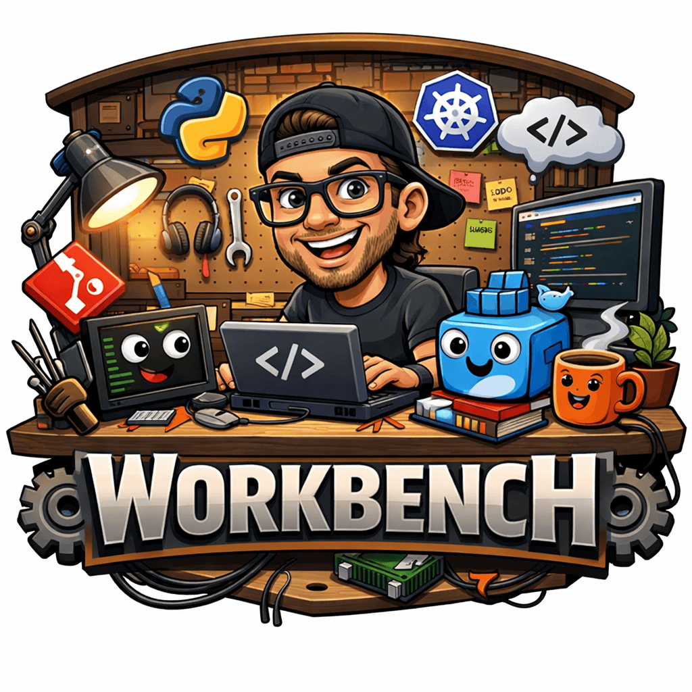

<p align="center">
  
</p>

A GitHub Codespaces devcontainer for general-purpose terminal, scripting, and DevOps work. Opens a fully configured Linux environment with your dotfiles, cloud CLIs, and Docker — ready in seconds.

> **Note:** This project is designed and tested specifically for **GitHub Codespaces**. While the devcontainer spec is technically portable, features like dotfiles integration, Codespaces secrets (`GITHUB_TOKEN`), and machine type requirements (`premiumLinux`) are GitHub Codespaces-specific and will not work as expected in other devcontainer environments (e.g., VS Code Dev Containers running locally).

## Getting started

1. Create a new Codespace from this repo
2. Codespaces automatically installs your dotfiles via `setup.sh`
3. `post-create.sh` runs `dotfiles_bootstrap` and installs shell functions

Configure once in your GitHub settings:

- **Dotfiles**: github.com/settings/codespaces → set your dotfiles repo
- **SSH keys**: github.com/settings/codespaces → add your SSH key for git access
- **Secrets**: set `GH_PAT` (personal PAT) and optionally `GH_TOKEN_ORG` (org PAT) to enable `ghrepo` — see [Creating a PAT](#creating-a-pat) below

## What's included

### Base image

`mcr.microsoft.com/devcontainers/base:ubuntu-24.04` — minimal Ubuntu 24.04 LTS with no pre-installed runtimes. Everything else is added via features, mise, or dotfiles.

### Added by devcontainer features

| Tool | Purpose |
|---|---|
| common-utils | Sets zsh as default shell |
| github-cli | `gh` CLI |
| git-lfs | Large file support |
| docker-outside-of-docker | Docker socket wiring for compose and builds |
| fish | Friendly shell — installed via `post-create.sh` |

> **Note:** Runtimes and cloud CLIs (kubectl, helm, AWS, gcloud, Azure, etc.) are not pre-installed. Add them via mise when needed — e.g. `mise use -g aqua:aws-cli` or add to a repo's `mise.toml`.

### Added by dotfiles (`dotfiles_bootstrap`)

| Tool | Purpose |
|---|---|
| Oh My Zsh + plugins | Shell framework with autosuggestions, syntax highlighting |
| eza | Modern `ls` replacement |
| bat | `cat` with syntax highlighting |
| fd | Fast `find` replacement |
| ripgrep | Fast `grep` replacement |
| fzf | Fuzzy finder |
| git-delta | Better git diffs |
| mise | Runtime version manager |
| qsv | CSV toolkit |
| Claude CLI | Anthropic's Claude in the terminal |

### Shell configuration

Your dotfiles provide:

- **zsh** with Oh My Zsh, custom theme pool, autosuggestions, syntax highlighting
- **fish** with fzf integration, mise activation
- Aliases for `ls/eza`, `cat/bat`, `fd`, `ripgrep`, git shortcuts, docker, kubectl
- fzf functions: `fe` (fuzzy edit), `fzp` (fuzzy preview), `rge` (ripgrep → editor), `rgf` (ripgrep → fzf)

### Project-level tools

Repos cloned into this workspace bring their own `mise.toml`. Run `mise install` inside any repo to get its required runtimes and tools (terraform, rust, specific node/python versions, etc.).

## Creating a PAT

`ghrepo` authenticates to the GitHub API using Personal Access Tokens stored as Codespaces secrets.

> **Note on fine-grained PATs:** Fine-grained tokens are scoped to a single resource owner (your personal account **or** one organization). If you want `ghrepo` to search both your personal repos and an org's repos, you need two tokens — one per owner — stored as separate secrets (`GH_PAT` and `GH_TOKEN_ORG`). Classic tokens can cover both with a single token using the `read:org` scope.

### 1. Generate the token(s)

Go to **github.com/settings/tokens** and choose one of:

- **Classic token** (simpler, one token covers everything): click *Generate new token (classic)*
- **Fine-grained token** (more restrictive, one token per owner): click *Generate new token (beta)*

**Classic token — required scopes:**

| Scope | Why |
|---|---|
| `repo` | Read access to your private repositories |
| `read:org` | List repositories in organizations you belong to |

**Fine-grained token — required permissions:**

Create one token for your personal account and one for each org you want to search.

| Permission | Access level | Why |
|---|---|---|
| Repository access | *All repositories* (or select specific repos) | Allows listing repos |
| Contents | Read-only | Required by the repos permission |
| Members | Read-only (org tokens only) | List org members/repos |

Set an expiration that fits your workflow (90 days is a reasonable default), then copy the generated token — you won't see it again.

### 2. Add as Codespaces secrets

You can store secrets at the **user level** (available to all your codespaces) or at the **repository level** (only available inside codespaces for this repo).

> **Note on secret naming:** GitHub Codespaces reserves environment variables starting with `GITHUB_` and won't let you store secrets with that prefix. All secrets use the `GH_` prefix instead. `post-start.sh` maps `GH_PAT` → `GITHUB_TOKEN` on every container start so the `gh` CLI picks it up automatically.

| Secret name | Value | Required |
|---|---|---|
| `GH_PAT` | Personal account PAT (or classic token) | Yes |
| `GH_TOKEN_ORG_<NAME>` | Org-specific PAT, e.g. `GH_TOKEN_ORG_MYCOMPANY` | One per org (fine-grained) |
| `GH_TOKEN_ORG` | Generic org PAT fallback | Optional |

`ghrepo` uses `GH_PAT` (via `GITHUB_TOKEN`) for personal repo lookups. When you pass `-o <org>`, it resolves the token in this order:

1. `GH_TOKEN_ORG_<ORGNAME>` — org-specific (e.g. `GH_TOKEN_ORG_MYCOMPANY` for org `mycompany`)
2. `GH_TOKEN_ORG` — generic org fallback
3. `GITHUB_TOKEN` — personal / classic token (set from `GH_PAT` at startup)

The `<ORGNAME>` suffix is the org name uppercased with non-alphanumeric characters replaced by `_`. You can have as many org-specific secrets as you need — one per org.

**User-level (recommended):**

1. Go to **github.com/settings/codespaces**
2. Under *Secrets*, click **New secret**
3. Set the name and value for each secret above
4. Under *Repository access*, select **this repository** (workbench) plus any other repos where you want it available
5. Click **Add secret**

**Repository-level:**

1. Go to this repo → **Settings → Secrets and variables → Codespaces**
2. Click **New repository secret**
3. Add each secret by name and value
4. Click **Add secret**

Once secrets are saved, Codespaces injects them as environment variables when the container starts. No restart is needed if you set them before creating the Codespace; if you add them after, rebuild the container (`Codespaces: Rebuild Container` from the VS Code command palette).

> **Note:** GitHub automatically provides a built-in `GITHUB_TOKEN` in Actions workflows, but Codespaces does **not** inject one automatically — you must set `GH_PAT` as a Codespaces secret, and `post-start.sh` will map it to `GITHUB_TOKEN` for you.

## ghrepo

Fuzzy-search your GitHub repos and clone any on demand. Available in both zsh and fish.

```
ghrepo                     # fzf picker → clone to ~/repos/<owner>/<repo>
ghrepo <query>             # pre-filtered search
ghrepo -o <org> [query]    # include an org's repos
ghrepo -d <path> [query]   # clone to a specific path
ghrepo list [query]        # print matches without cloning
```

Inside the fzf picker:
- `ENTER` — clone selected repo
- `CTRL-O` — open repo in browser
- `ESC` — cancel

Cloned repos land in `~/repos/<owner>/<repo>` by default. Set `GHREPO_DIR` to change the base path.

## VS Code extensions

| Extension | Purpose |
|---|---|
| bash-ide, shell-format, shellcheck | Shell script editing and linting |
| GitLens, git-graph | Git history and blame |
| vscode-yaml, even-better-toml | Config file editing |
| vscode-docker | Docker integration |
| errorlens | Inline error display |
| Material Theme + Icons | UI theme |

## Structure

```
.devcontainer/
├── devcontainer.json     # container definition
└── scripts/
    ├── post-create.sh    # runs once on container creation
    ├── post-start.sh     # runs on every container start
    ├── ghrepo.zsh        # ghrepo function for zsh
    └── ghrepo.fish       # ghrepo function for fish
```
